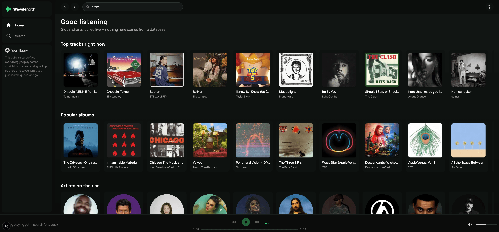

<div align="center">
  <br />

  <p align="center">
  
  </p>

  <h1>🎧 Wavelength</h1>

  <p>
    A Spotify-style music player, built frontend-first on a live public catalog.<br/>
    No database. No auth. No saved user data — every screen is a real-time lookup.
  </p>

  <br />

  <div>
    
    
    
    
    
    
    
    
    
    
    
  </div>
</div>

## 📋 Table of Contents

1. 🤖 [Introduction](#introduction)
2. ⚙️ [Tech Stack](#tech-stack)
3. 🔋 [Features](#features)
4. 🤸 [Quick Start](#quick-start)
5. 🗂️ [Project Structure](#project-structure)
6. 🕸️ [Snippets](#snippets)
7. ♿ [Accessibility](#accessibility)
8. 🧠 [Architecture Notes](#architecture-notes)
9. 📌 [Known Limitations](#known-limitations)

## <a name="introduction">🤖 Introduction</a>

Wavelength is a Spotify-style music player UI built entirely on the client side, backed by the public Deezer catalog for search, artists, albums, and 30-second track previews. There's no database and no authentication anywhere in the stack — every list, chart, and queue on screen comes from a live API call, not a stored record.

The project was built to demonstrate a frontend engineer's judgment as much as their syntax: real-time data fetching and caching with TanStack Query, imperative audio-engine state (Howler.js) synchronized with a Zustand store, a full light/dark theming system built on CSS custom properties rather than duplicated utility classes, and accessibility treated as a first-class requirement rather than an afterthought — visible focus states, `prefers-reduced-motion` support, and `aria-label`s on every icon-only control.

## <a name="tech-stack">⚙️ Tech Stack</a>

- **Next.js 16** (App Router) + **TypeScript**
- **React 19**
- **Tailwind CSS v4** — theme tokens live in `app/globals.css` via `@theme`, not a JS config file
- **TanStack Query** — data fetching, caching, and loading/error states
- **Zustand** — playback queue and theme state
- **Framer Motion** — hover/entrance motion
- **Radix UI primitives** (Slider, Scroll Area, Slot) — hand-built shadcn-style components, no CLI dependency
- **Howler.js** — audio playback engine
- **react-icons**
- **Deezer API** — search, charts, albums, artists, and preview audio

## <a name="features">🔋 Features</a>

👉 **Live search** across tracks, albums, and artists — no mock data anywhere in the app.

👉 **Full playback engine** — queueing, play/pause, next/previous, seek, and volume, all backed by Howler.js and driven through a single Zustand store.

👉 **Light & dark mode** — a from-scratch theming system using CSS custom properties, toggled instantly with no flash on reload, persisted to `localStorage`.

👉 **Fully responsive** — a three-pane desktop layout that collapses to a single-column mobile experience with its own tailored navigation, not just a squeezed-down desktop view.

👉 **Accessible by default** — visible keyboard focus rings, `prefers-reduced-motion` support, and labeled icon-only controls throughout.

👉 **Zero setup** — no API keys, no `.env` file, no signup required. Clone it and run it.

## <a name="quick-start">🤸 Quick Start</a>

**Prerequisites:** [Node.js](https://nodejs.org/en) and npm.

```bash
git clone <your-repo-url>
cd wavelength
npm install
npm run dev
```

Open [http://localhost:3000](http://localhost:3000). That's it — no environment variables, no API keys, no database to provision.

## <a name="project-structure">🗂️ Project Structure</a>

```
app/
  api/deezer/route.ts   – the one server route, a stateless CORS pass-through
  page.tsx              – home: live charts
  search/page.tsx        – search results (tracks/albums/artists)
  album/[id]/page.tsx    – album detail + track list
  artist/[id]/page.tsx   – artist detail + top tracks + albums
components/
  layout/                – sidebar, topbar, player bar, theme toggle
  ui/                    – Button, Input, Slider, Skeleton, ScrollArea
  track-row.tsx, media-card.tsx, shelf.tsx
hooks/use-deezer.ts       – TanStack Query hooks
lib/deezer.ts             – typed client for the proxy route
store/
  player-store.ts         – Zustand + Howler playback engine
  theme-store.ts          – light/dark theme state
types/deezer.ts           – Deezer response shapes + normalizer
```

## <a name="snippets">🕸️ Snippets</a>

<details>
<summary><code>app/api/deezer/route.ts</code> — the only server code in the app</summary>

Deezer's public API doesn't send CORS headers, so the browser can't call it directly. Rather than reach for a database or a full backend, this is a single stateless pass-through route:

```typescript
import { NextRequest, NextResponse } from "next/server";

const DEEZER_BASE = "https://api.deezer.com";

const ALLOWED_PATH_PREFIXES = [
  "/search",
  "/chart",
  "/album/",
  "/artist/",
  "/track/",
  "/playlist/",
];

export async function GET(request: NextRequest) {
  const { searchParams } = new URL(request.url);
  const path = searchParams.get("path");

  if (!path || !ALLOWED_PATH_PREFIXES.some((p) => path.startsWith(p))) {
    return NextResponse.json(
      { error: "Missing or disallowed 'path' parameter." },
      { status: 400 }
    );
  }

  const forwarded = new URLSearchParams(searchParams);
  forwarded.delete("path");
  const target = `${DEEZER_BASE}${path}?${forwarded.toString()}`;

  const res = await fetch(target, { next: { revalidate: 60 } });
  const data = await res.json();
  return NextResponse.json(data);
}
```

</details>

<details>
<summary><code>store/player-store.ts</code> — Zustand driving a Howler.js audio engine</summary>

The playback engine lives outside React entirely — Howler's imperative event callbacks (`onplay`, `onend`, `onloaderror`) update a Zustand store, which every component subscribes to:

```typescript
function loadAndPlay(track: PlayableTrack, get: () => PlayerState, set: (p: Partial<PlayerState>) => void) {
  if (howl) howl.unload();
  set({ current: track, progress: 0, isLoading: true });

  howl = new Howl({
    src: [track.preview],
    html5: true,
    volume: get().volume,
    onplay: () => {
      set({ isPlaying: true, isLoading: false });
      const step = () => {
        if (howl) set({ progress: howl.seek() as number });
        rafId = requestAnimationFrame(step);
      };
      rafId = requestAnimationFrame(step);
    },
    onend: () => get().next(),
  });

  howl.play();
}
```

</details>

<details>
<summary><code>app/globals.css</code> — theme tokens as CSS variables, not duplicated classes</summary>

Every component references the same color tokens (`bg-base-900`, `text-white`, `text-neutral-400`) in both themes. Instead of adding `dark:`/`light:` variants everywhere, the tokens themselves resolve differently depending on a single class on `<html>`:

```css
:root {
  --surf-950: #0a0d0b;
  --fg-white: #ffffff;
}

.light {
  --surf-950: #ffffff;
  --fg-white: #121514;
}

@theme {
  --color-base-950: var(--surf-950);
  --color-white: var(--fg-white);
}
```

</details>

## <a name="accessibility">♿ Accessibility</a>

- Visible `:focus-visible` outlines throughout, instead of relying on (often invisible) browser defaults.
- `prefers-reduced-motion` disables the equalizer bounce, hover-lift, and transition animations for users who've asked their OS for less motion.
- Every icon-only control (play/pause, seek, volume, theme toggle, back/forward) has an `aria-label`.
- Light and dark themes were built with contrast in mind, not just inverted colors — a couple of accent colors that read fine on near-black failed contrast on white and were given theme-aware substitutes rather than left as-is.

## <a name="architecture-notes">🧠 Architecture Notes</a>

**Why is there a server route in a "frontend" app?** Deezer's public API doesn't set `Access-Control-Allow-Origin`, so a direct `fetch()` from the browser is blocked by CORS before it ever reaches Deezer. Rather than working around that with a database-backed backend, `app/api/deezer/route.ts` is a single stateless proxy — it forwards a path and query string and streams the response straight back, with a 60-second cache to cut down on duplicate upstream calls. No user data ever touches it.

**Why Tailwind v4 instead of a JS config?** v4 moved theme configuration into CSS via `@theme`, which turned out to be the cleaner mechanism for a runtime-toggleable light/dark theme: the same custom color tokens the whole app already uses are re-pointed at CSS variables that flip based on one class, instead of adding `dark:` variants to dozens of files.

## <a name="known-limitations">📌 Known Limitations</a>

These were deliberate scope decisions, not oversights:

- **30-second previews only** — Deezer's public API doesn't expose full track streaming without a licensing agreement, so playback is preview-only and the player bar says so.
- **No persisted library/playlists** — there's no database, so "your library" intentionally points at search instead of faking an empty state. Local-storage-backed playlists would be a natural next step.
- **Deezer rate limits** — generous but not unlimited; the proxy route's 60-second cache exists specifically to reduce duplicate calls during normal browsing.